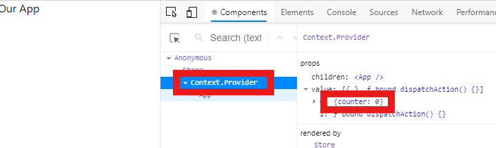
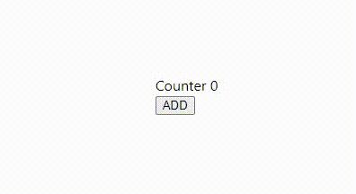
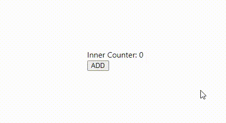
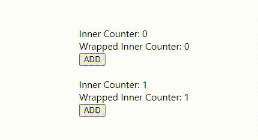

# Como manejar un estado global de aplicación usando React.Context y hooks

Muchas veces queremos tener un estado global de la aplicación y recurrimos a librerías externas para hacerlo, ya sea Redux, xState o cualquier otra, es una necesidad muy común y el equipo de React nos ha dado muchas herramientas para hacerlo, aunque por falta de experiencia a veces preferimos seguir usando librerías externas para cosas no tan complejas.

En este tutorial te voy a enseñar cómo manejar el estado global de tu aplicación usando solo React, sin librerías externas.

Aprenderás a hacerlo usando `React.Context`, tu propio Hook de React y `useReducer`.

Para empezar necesitamos crear un lugar donde guardar nuestro estado de la aplicación, si has trabajado con React y Hooks seguramente conoces `useState`, este hook es muy útil cuando nuestro estado es muy simple, pero a medida que crece nuestra aplicación se queda algo corto, por eso vamos a usar `useReducer`, para manejar nuestro estado usando un reducer.

Un reducer es una función que determina los cambios del estado de nuestra aplicación, esta función pura que recibe dos parámetros, el estado actual de la aplicación y la acción a ejecutar sobre este estado, el reducer al ser pura, retorna un nuevo estado sin modificar o mutar el estado anterior, con esto evitamos cambios indeseados en nuestra aplicación, es una práctica muy común que usan librerías como `Redux`.

Nuestro reducer luce así, por ahora solo retornamos el estado que llegue, luego le iremos agregando acciones para que cambie el estado de la aplicación.

```js
//Store/index.js
function reducer(state, action) {
  return state;
}
```

React tiene un hook especial para manejar estados basados en reducers, se llama `useReducer`, recibe dos parámetros, el primero es una función reducer y el segundo es el valor inicial, `useReducer` retorna un array con dos elementos, el primero es el estado y el segundo es una función a la que llamamos `dispatch`, nos sirve para enviar las acciones al reducer y así decirle cómo cambiar el estado.

Los hooks solo se pueden usar dentro de componentes de react u otros hooks por lo que vamos a crear un componente llamado `Store` para poder usar nuestro reducer y generar un estado inicial, para empezar vamos a darle de valor inicial `{ counter: 0 }`

```js
import { useReducer } from "react";

export const Store = () => {
  const [state, dispatch] = useReducer(reducer, { counter: 0 });
};
```

De aquí tenemos que conectarlo con TODA nuestra aplicación, por lo general si queremos pasar un valor de un componente a otro lo hacemos por medio de `props`, pero React nos da más herramientas para casos en los que los componentes pueden no ser descendientes directos, entre esas tenemos `React.Context` que nos permite crear un contexto local o global (global en este caso) para guardar y acceder datos.

Para usar `React.Context` simplemente importamos `createContext` de react, esta es una función que acepta un parámetro, el valor inicial del contexto, no necesitamos un valor inicial para el contexto entonces solo la ejecutamos y guardamos lo que retorna en una variable que llamaremos `StoreContext` para usar después.

```js
//Store/index.js
import { useReducer, createContext } from "react";

const StoreContext = createContext();
```

`StoreContext` es un objeto con un montón de cosas dentro, por ahora solo nos interesa `Provider`, este es un componente de React que es la manera en que le vamos a pasar el estado a nuestra aplicación, `StoreContext` tiene un `prop` llamado `value` que es donde le pasamos los datos que queremos que guarde en el contexto, en este caso le vamos a pasar un `Array` con dos elementos, el primero es el `state` que nos da `useReducer`, y el segundo es la función `dispatch`.

Para que nuestra aplicación obtenga acceso al contexto tenemos que envolverla con `StoreContext.Provider`, por esto hicimos qué `Store` fuera un componente, el va a recibir otros componentes y los va a envolver dentro de `StoreContext.Provider`, esto lo hacemos obteniendo el `prop` `children` de `Store` y pasándoselo como hijo a `StoreContext.Provider`.

```js
export const Store = ({ children }) => {
  const [state, dispatch] = useReducer(reducer, { counter: 0 });

  return (
    <StoreContext.Provider value={[state, dispatch]}>
      {children}
    </StoreContext.Provider>
  );
};
```

Ahora solo tenemos que envolver nuestra aplicación con el componente `Store` que creamos.

```js
// App.js
import React from "react";
import { Store } from "./store";

function App() {
  return <div>Our App</div>;
}

export default () => (
  <Store>
    <App />
  </Store>
);
```

¿Cómo lo probamos? Si tienes instalado React Developer Tools (deberias, son super útiles), puedes abrir las herramientas de desarrollador de tu navegador y en la pestaña de Components vas a encontrar que la aplicación está envuelta en `Context.Provider`, y este tiene dentro de `value` el valor de nuestro estado global.



Ahora ya tenemos nuestro estado global conectado, pero aun no podemos leerlo, accederlo vamos a crear nuestro propio React Hook, lo que hará es darnos acceso al estado global y una función que llamaremos `dispatch` para enviar acciones a nuestro reducer.

Para esto usaremos un hook de React, `useContext`, este hook nos retorna lo que tengamos guardado en el contexto, en este caso tenemos un `Array` con dos elementos, nuestro `state` y `dispatch`, nuestro hook simplemente los retorna para que cualquier componente que lo llame tenga acceso.

```js
//Store/index.js

export const useStore = () => {
  const [state, dispatch] = useContext(StoreContext);

  return [state, dispatch];
};
```

Ahora, para conectar un componente a nuestro estado global, simplemente tenemos que importar nuestro hook y usarlo dentro del componente, para empezar vamos usarlo dentro de nuestra `App`, y con esto tenemos acceso a `state.count`.

```js
//App.js

import { Store, useStore } from "./store";

function App() {
  const [state] = useStore();

  return <div>Counter {state.count}</div>;
}
```

Solo falta poder modificar nuestro estado, para esto vamos a agregar la acción `ADD` a nuestro reducer, cada vez que se llame, aumentaremos en uno nuestro contador, el reducer crea un nuevo estado (`newState`) cada vez que quiera modificarlo y retorna este nuevo estado, con esto evitamos modificar el estado anterior.

```js
//Store/index.js

function reducer(state, action) {
  switch (action.type) {
    case "ADD": {
      const newState = { ...state };

      newState.count++;

      return newState;
    }
    default:
      return state;
  }
}
```

Luego de agregarlo al reducer solo tenemos que lanzarlo desde cualquier lugar de nuestra aplicación usando `dispatch`.

```js
//App.js

function App() {
  const [state, dispatch] = useStore();

  return (
    <div>
      <div>Counter {state.count}</div>
      <button onClick={() => dispatch({ type: "ADD" })}>ADD</button>
    </div>
  );
}
```



Ya tenemos todo listo, para probar que funcione vamos a acceder nuestro estado global desde otro componente, vamos a crear `InnerComponent` para esto, simplemente usamos nuestro hook `useStore` donde necesitemos acceder o modificar nuestro estado global.

```js
//components/inner.component.js

import React from "react";
import { useStore } from "../store";

export default function InnerComponent() {
  const [state] = useStore();

  return <span>Inner Counter: {state.count}</span>;
}

//App.js
import { InnerComponent } from "./components/inner.component";

function App() {
  const [state, dispatch] = useStore();

  return (
    <div>
      <InnerComponent />
      <button onClick={() => dispatch({ type: "ADD" })}>ADD</button>
    </div>
  );
}
```



No importa que tan lejos esté nuestro componente del contenedor de la aplicación, puede estar dentro de otro componente que no use nuestro hook `useStore` e igual va a funcionar, para probarlo vamos a crear `WrapperComponent` que solamente sirve para contener `InnerComponent`.

```js
//components/wrapper.component.js
import React from "react";
import InnerComponent from "./inner.component";

export default function WrapperComponent() {
  return (
    <div>
      Wrapped <InnerComponent />
    </div>
  );
}

//App.js
import { WrapperComponent } from "./components/wrapper.component";

function App() {
  const [state, dispatch] = useStore();

  return (
    <div>
      <InnerComponent />
      <WrapperComponent />
      <button onClick={() => dispatch({ type: "ADD" })}>ADD</button>
    </div>
  );
}
```


De aquí en adelante, podemos hacer algunas mejoras, para empezar, vamos a pedir el estado inicial usando un prop de nuestro componente `Store`, después de recibirlo, se lo pasamos a `useReducer`.

```js
//store/index.js
export const Store = ({ initialState, children }) => {
  const [state, dispatch] = useReducer(reducer, initialState);

  return (
    <StoreContext.Provider value={[state, dispatch]}>
      {children}
    </StoreContext.Provider>
  );
};

//App.js

export default () => (
  <Store initialState={{ count: 0 }}>
    <App />
  </Store>
);
```

Para ayudarnos a desarrollar y ver qué acciones y datos estamos enviando, podemos crear un logger global muy fácilmente, sólo tenemos que envolver nuestro el `dispatch` de nuestro hook `useStore` en una función anónima para agregarle un `console.table` y ver que estamos enviando.

```js
//store/index.js

export const useStore = () => {
  const [state, dispatch] = useContext(StoreContext);

  return [
    state,
    (action) => {
      console.table(action);
      dispatch(action);
    },
  ];
};
```

Con esto ya tenemos nuestro estado global y podemos usarlo en diferentes aplicaciones si queremos, cada una tendrá un estado diferente gracias al contexto de React, por ej, podemos tener dos apps así:

```js
//App.js

export default () => (
  <div>
    <Store initialState={{ count: 0 }}>
      <App />
    </Store>
    <Store initialState={{ count: 1 }}>
      <App />
    </Store>
  </div>
);
```



En caso de que queramos usar nuestro código de estado global en múltiples aplicaciones o componentes que no compartan un mismo `reducer`, podemos usar el mismo principio del estado inicial para recibir un `reducer` por medio de un `prop` y usarlo en vez de tener un reducer global.

```js
//store/counter.reducer.js

function reducer(state, action) {
  switch (action.type) {
    case "ADD": {
      const newState = { ...state };

      newState.count++;

      return newState;
    }
    default:
      return state;
  }
}

//store/index.js

export const Store = ({ initialState, reducer, children }) => {
  const [state, dispatch] = useReducer(reducer, initialState);

  return (
    <StoreContext.Provider value={[state, dispatch]}>
      {children}
    </StoreContext.Provider>
  );
};

//App.js

import CounterReducer from "./store/counter.reducer";

export default () => (
  <Store initialState={{ count: 0 }} reducer={CounterReducer}>
    <App />
  </Store>
);
```

Y listo, asi podemos manejar el estado global de nuestra aplicación usando `React.Context`, nuestro propio hook de React y `useReducer`.
